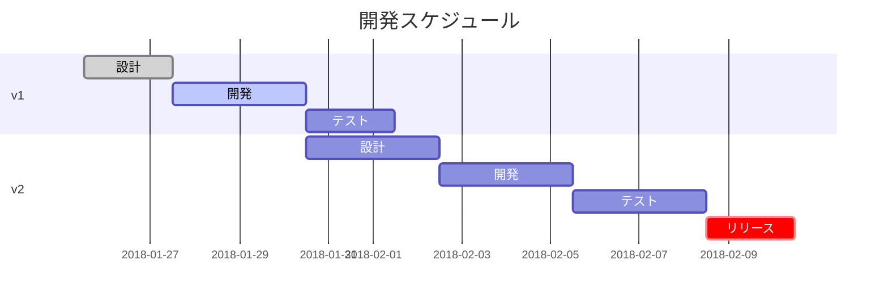

This is a tutrial of MPC_controller

## MPC_controller
- objective

  MPCコントローラの実装を行う．
- contributor

  Tomohiro Otsu
- start project date
  
  2021/07/15

  
https://github.com/tommy-otsu/MPC_controller/blob/main/uml.txt
